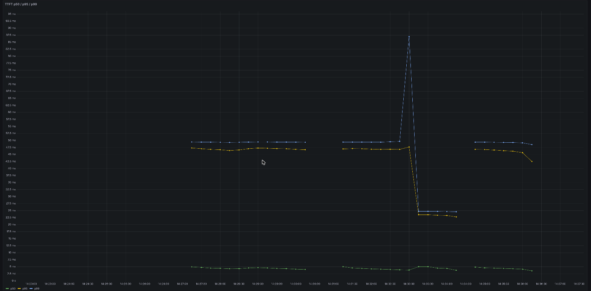
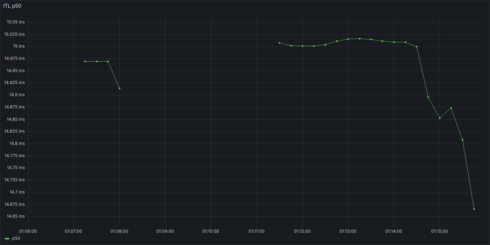
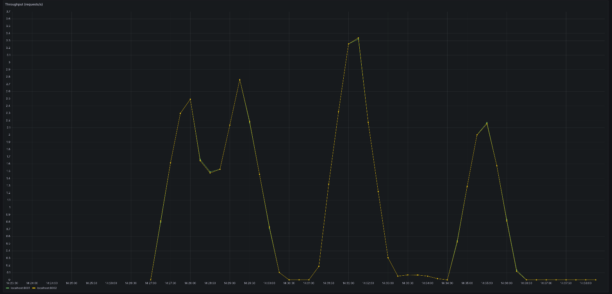
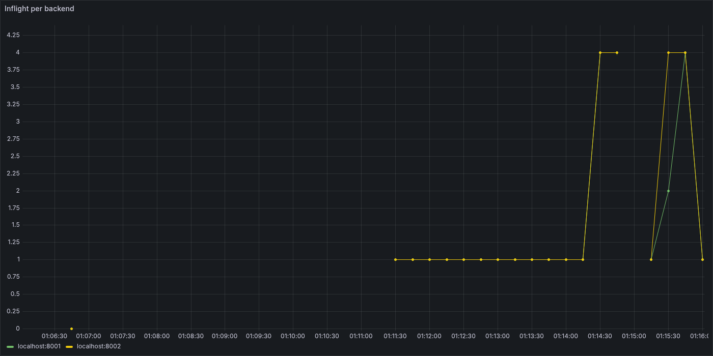

# kvroute

A latency-aware gateway in front of vLLM replicas: it reuses KV cache by
routing requests to the replica already holding a matching prompt prefix,
avoids redundant inference with a two-tier response cache, and protects
GPU capacity with token-budget admission control.

## Why

Wiring an HTTP proxy in front of an LLM backend is the easy part. The
interesting problems are the ones specific to serving LLMs: a KV cache that
only pays off if requests with the same prefix land on the same replica,
response caching that has to decide what "the same request" even means
(exact bytes? semantically equivalent?), and admission control that has to
budget on tokens instead of requests because a 50-token and a 5000-token
request cost two orders of magnitude apart. This project exists to make
those tradeoffs concrete and measurable rather than theoretical.

## Concepts used

| Concept | Where |
|---|---|
| Streaming passthrough with client-disconnect cancellation | `app.py` |
| TTFT / ITL latency histograms, sized for sub-second LLM latencies | `metrics.py` |
| Round-robin routing with failure tracking + cooldown | `router.py` |
| Exact-match response cache, per-tenant namespaced, Redis-backed | `cache.py` |
| Semantic response cache (embedding + cosine similarity threshold) | `embeddings.py`, `semantic_cache.py` |
| Prefix-aware routing with load-imbalance shedding | `router.py` |
| Token-bucket admission control with interactive/batch priority classes | `admission.py` |
| Open-loop load generation (fixed send rate, doesn't hide saturation) | `bench/load_harness.py` |

## Simplifications vs. `arch.md`

`arch.md` is the aspirational full spec. A few deliberate simplifications
remain, since this doesn't need to be production infrastructure:

- **Prefix index stays in-process** rather than in Redis — it only produces
  reproducible routing with a single uvicorn worker, which is fine here.
  Both caches (exact-match and semantic) *do* use Redis, with per-tenant key
  namespacing and TTL.
- **Semantic search is a plain-Redis linear scan** (SCAN + client-side cosine
  similarity), not RediSearch/HNSW. That's the same O(n) cost an in-memory
  list would have; Redis buys namespacing and shared TTL eviction here, not
  search speed. A real ANN index is the natural next step once n stops
  being small.
- **Toy embeddings, not sentence-transformers.** `embeddings.py` is a
  stopword-filtered hashing trick, not a real model. It's enough to
  demonstrate cosine similarity and threshold tuning without a
  torch/model-download dependency. Swapping in a real model is a
  one-function change.
- **Admission control reserves capacity instead of preempting.** Interactive
  and batch traffic share a concurrency budget where batch is capped at
  half; there's no literal preemption of an in-flight streaming request
  (there isn't a natural pause point once an HTTP stream is open). Same
  effect on interactive latency, less machinery.
- **Exact-match cache stores chunks as base64 inside one JSON value per
  key**, namespaced per tenant with a single TTL — keeps the whole response
  under one TTL instead of managing eviction per-chunk.

## Results

Captured against a real `Qwen/Qwen2.5-1.5B-Instruct` vLLM backend on an L4
GPU (not the mock upstream) — raw data in `bench/results/`.

| TTFT p50/p95/p99 | ITL p50 |
|---|---|
|  |  |

| Throughput per backend | Inflight per backend |
|---|---|
|  |  |

- **Baseline TTFT** (single request at a time, `bench/capture_baseline.py`):
  p50 308ms, p95 542ms, p99 898ms.
- **round_robin vs. prefix_aware A/B** (`bench/ab_run.py` +
  `bench/ab_compare.py`): the two strategies' TTFT confidence intervals did
  not overlap in either run order tested, but which one came out faster
  flipped depending on whether it ran first or second in the sequence —
  evidence the delta was dominated by a run-order confound (GPU/cache state
  drifting over the session) rather than a clean strategy effect, since the
  two arms were two separate timed runs minutes apart. The gateway now
  supports picking a strategy per request via `x-kvroute-strategy`
  (`app.py` keeps both routers live instead of fixing one at startup), and
  `bench/ab_interleaved.py` uses that to alternate strategies per request
  in one continuous, randomized-order sequence — controlling for the
  confound instead of just flagging it. Not yet run against a real backend
  (needs a GPU pod); numbers above are from the original two-run version.
- **Stress test** (three load profiles run as concurrent processes, 60
  req/s combined): 2630 requests sent, 466 admitted, 2164 shed by admission
  control. The gateway stayed healthy and responsive throughout — the
  token-bucket + concurrency cap did its job protecting the two vLLM
  replicas from overload instead of letting latency degrade unbounded.
- **Cache hits confirmed live**: a repeated identical request returned
  `x-kvroute-cache: exact_hit`; a reworded-but-similar prompt returned
  `x-kvroute-cache: semantic_hit`.

## Running it

Against the mock upstream (`tests/mock_upstream.py`, no GPU needed):

```bash
poetry install
docker compose up -d redis   # or: brew services start redis
python -m uvicorn tests.mock_upstream:app --port 8001 &
python -m uvicorn tests.mock_upstream:app --port 8002 &
KVROUTE_STRATEGY=round_robin uvicorn app:app --port 8000 &   # or prefix_aware

curl -N -X POST localhost:8000/v1/chat/completions \
  -H 'content-type: application/json' \
  -d '{"stream":true,"messages":[{"role":"user","content":"hi"}]}'
```

Benchmarks and checks:

```bash
python tests/run_smoke.py                             # cancellation on client disconnect
python bench/capture_baseline.py                       # baseline TTFT
python bench/eval_semantic_cache.py                     # hit-rate / false-hit-rate curve
python bench/ab_run.py --strategy round_robin           # repeat with --strategy prefix_aware, then
python bench/ab_compare.py                               # compare the two
python bench/ab_interleaved.py --pairs 30                # or: interleaved, randomized-order A/B
python bench/load_harness.py --profile shared_prefix    # also: unique_prompt, mixed_tenant
```

### Against real vLLM (GPU)

The mock upstream can't produce real prefix-cache or throughput behavior —
it's just canned tokens. `Dockerfile` builds a container that starts Redis,
two `Qwen/Qwen2.5-1.5B-Instruct` vLLM instances (`--enable-prefix-caching`,
ports 8001/8002), and the gateway itself, all on boot. One L4 or A10 (24GB)
is enough.

```bash
docker build -t kvroute-gpu .
docker run --gpus all -p 8000:8000 -p 8001:8001 -p 8002:8002 kvroute-gpu
```

Override the model with `-e VLLM_MODEL=...`. Once it's up, run the same
benchmarks above against `localhost:8000`.

### Observability

```bash
docker compose up -d redis prometheus grafana renderer
```

Prometheus scrapes the gateway's `/metrics` every second (TTFT is
sub-second, so the default 15s interval would alias right over it), and a
`kvroute` dashboard (TTFT/ITL/throughput/inflight) is provisioned in
Grafana at `localhost:3000` automatically. The `renderer` service
(`grafana-image-renderer`) lets you pull any panel as a PNG directly:

```bash
curl "http://localhost:3000/render/d-solo/kvroute/kvroute?orgId=1&panelId=1&width=1400&height=700&from=now-15m&to=now" -o ttft.png
```
