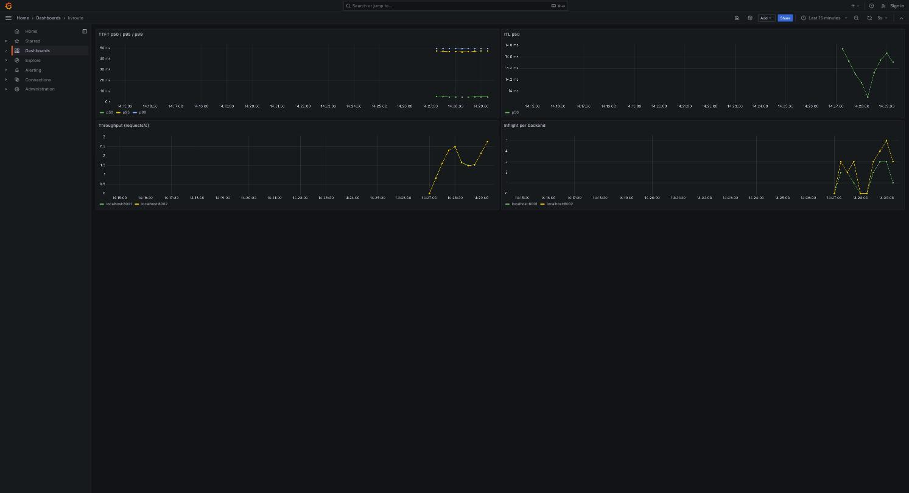

# kvroute

Building through `kvroute-build-guide.md`, step by step.

## Status

Steps 1-5 and 7-12 are implemented against the mock upstream
(`tests/mock_upstream.py`). Steps 13/14 (writeup, EKS) are intentionally not
code. Step 6 (a real vLLM backend) has also been run end-to-end on a GPU pod
— see [Running against real vLLM](#running-against-real-vllm-gpu) and the
captured results in `bench/results/`.



| Step | What | File |
|---|---|---|
| 1-2 | Streaming passthrough + cancellation | `app.py` |
| 3 | TTFT/ITL metrics | `metrics.py` |
| 4 | Baseline capture | `bench/capture_baseline.py` |
| 5 | Round-robin routing + health tracking | `router.py` |
| 7 | Exact-match cache | `cache.py` |
| 8 | Semantic cache + eval | `embeddings.py`, `semantic_cache.py`, `bench/eval_semantic_cache.py` |
| 9-10 | Prefix-aware routing + imbalance shedding + A/B | `router.py`, `bench/ab_run.py`, `bench/ab_compare.py` |
| 11 | Admission control | `admission.py` |
| 12 | Open-loop load harness | `bench/load_harness.py` |

## Simplifications vs. `arch.md`

`arch.md` is the aspirational full spec. A couple of deliberate
simplifications remain, for a learning repo that doesn't need production
infrastructure:

- **Prefix index stays in-process,** per Step 9 of the build guide itself —
  moving it to Redis is the guide's own documented next step, not something
  to build now. Both caches (exact-match and semantic) *do* use Redis, with
  per-tenant key namespacing and TTL.
- **Semantic search is a plain-Redis linear scan (SCAN + client-side cosine
  similarity), not RediSearch/HNSW.** That's the same O(n) cost an in-memory
  list would have; Redis buys namespacing and shared TTL eviction here, not
  search speed. A real ANN index is the documented next step once n stops
  being small.
- **Toy embeddings, not sentence-transformers.** `embeddings.py` is a
  stopword-filtered hashing trick, not a real model. It's enough to
  demonstrate cosine similarity, threshold tuning, and the negation
  blind-spot the guide asks you to find — without a torch/model-download
  dependency. Swapping in a real model is a one-function change.
- **Admission control reserves capacity instead of preempting.** Budgets are
  on tokens, not requests — a 50-token and a 5000-token request cost two
  orders of magnitude apart, so a request-rate limit lets one long-prompt
  tenant starve everyone else while under quota. Interactive and batch share
  a concurrency budget where batch is capped at half; there's no literal
  preemption of an in-flight streaming request (there isn't a natural pause
  point once an HTTP stream is open). Same effect on interactive latency,
  less machinery.
- **Exact-match cache stores chunks as base64 inside one JSON value per key,**
  namespaced per tenant with a single TTL — Redis strings handle arbitrary
  bytes fine, but keeping the whole response as one value keeps the TTL
  simple.

## Benchmarking notes

- **A/B comparison (`bench/ab_compare.py`)** reports each run's mean with a
  95% CI (normal approximation: mean +/- 1.96 * stdev / sqrt(n)) and flags
  when the two arms' CIs overlap on any repeated run as an inconclusive
  result.
- **A/B workload (`bench/ab_run.py`)** is shared-prefix heavy (one long
  system prompt reused across requests), since that's the pattern prefix
  routing is meant to help. Against `tests/mock_upstream.py`, which doesn't
  model prefix-cache speedup, expect no real delta — that only shows up once
  the backend is a real vLLM instance running with `--enable-prefix-caching`.
- **Load harness (`bench/load_harness.py`)** is open-loop, not closed-loop:
  requests are sent at a fixed rate regardless of when earlier ones finish.
  A closed-loop generator (wait for a response before sending the next) caps
  offered load at the gateway's own latency and hides saturation.

## Running it

```bash
poetry install
docker compose up -d redis   # or: brew services start redis
python -m uvicorn tests.mock_upstream:app --port 8001 &
python -m uvicorn tests.mock_upstream:app --port 8002 &
KVROUTE_STRATEGY=round_robin uvicorn app:app --port 8000 &   # or prefix_aware

curl -N -X POST localhost:8000/v1/chat/completions \
  -H 'content-type: application/json' \
  -d '{"stream":true,"messages":[{"role":"user","content":"hi"}]}'
```

Acceptance checks:

```bash
python tests/run_smoke.py                    # Step 2: cancellation
python bench/capture_baseline.py             # Step 4: baseline TTFT
python bench/eval_semantic_cache.py          # Step 8: hit-rate / false-hit-rate curve
python bench/ab_run.py --strategy round_robin   # Step 10: repeat with prefix_aware, then
python bench/ab_compare.py                      #          compare
python bench/load_harness.py --profile shared_prefix  # Step 12 (also unique_prompt, mixed_tenant)
```

## Running against real vLLM (GPU)

The mock upstream (`tests/mock_upstream.py`) can't produce real prefix-cache
or throughput behavior — it's just canned tokens. To get real numbers,
`Dockerfile` builds a container that starts Redis, two
`Qwen/Qwen2.5-1.5B-Instruct` vLLM instances (`--enable-prefix-caching`, ports
8001/8002), and the gateway itself, all on boot. One L4 or A10 (24GB) is
enough.

```bash
docker build -t kvroute-gpu .
docker run --gpus all -p 8000:8000 -p 8001:8001 -p 8002:8002 kvroute-gpu
```

Override the model with `-e VLLM_MODEL=...`. Once it's up, run
`tests/run_smoke.py` and the acceptance checks above against
`localhost:8000` as usual — no need to shell into the container.
